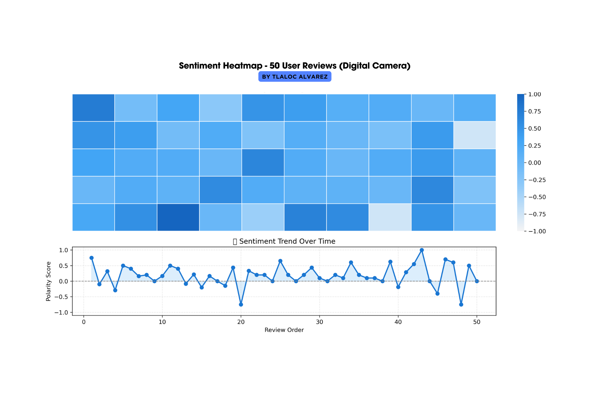

# Sentiment Heatmap – 50 User Reviews (Digital Camera)



This notebook shows how to analyze user comments using sentiment analysis.  
Although we use digital camera reviews, this approach works for any product or service.

---

### Step 1: Import libraries

We import essential libraries for data handling, plotting, and sentiment analysis.

```python
import pandas as pd
import numpy as np
import matplotlib.pyplot as plt
import seaborn as sns
from textblob import TextBlob
from matplotlib.colors import LinearSegmentedColormap

%matplotlib inline
```

---

### Step 2: Load and clean the dataset

We read a CSV with customer reviews and remove entries with missing text.

```python
df = pd.read_csv("digital_camera_reviews.csv")
df = df.dropna(subset=['comment'])  # Remove empty comments
```

---

### Step 3: Analyze sentiment

Using TextBlob, we score each comment from -1 (negative) to +1 (positive).

```python
df['sentiment_score'] = df['comment'].apply(lambda x: TextBlob(str(x)).sentiment.polarity)
```

---

### Step 4: Prepare data for the heatmap

We extract the first 50 reviews and shape them into a 5x10 matrix.

```python
data = df['sentiment_score'].values[:50]
rows, cols = 5, 10

if len(data) < rows * cols:
    data = np.append(data, [np.nan] * (rows * cols - len(data)))

heat_matrix = np.reshape(data, (rows, cols))
```

---

### Step 5: Create a color palette

We define a smooth blue color gradient for the heatmap.

```python
blue_cmap = LinearSegmentedColormap.from_list(
    "gray_to_blue",
    ["#f5f5f5", "#90caf9", "#42a5f5", "#1565c0"],
    N=256
)
```

---

### Step 6: Plot results

We show a heatmap of 50 comments and a line chart of sentiment trends.

```python
fig, axs = plt.subplots(2, 1, figsize=(12, 6), gridspec_kw={"height_ratios": [2, 1]}, constrained_layout=True)

# Heatmap
sns.heatmap(
    heat_matrix,
    ax=axs[0],
    cmap=blue_cmap,
    vmin=-1,
    vmax=1,
    linewidths=0.5,
    linecolor='white',
    xticklabels=False,
    yticklabels=False
)
axs[0].set_title("Sentiment Heatmap – 50 Digital Camera Reviews", fontsize=13, weight='bold')

# Line Plot
axs[1].plot(range(1, len(data)+1), data, marker='o', linestyle='-', color='#1976d2', linewidth=2)
axs[1].fill_between(range(1, len(data)+1), data, color="#bbdefb", alpha=0.5)
axs[1].axhline(0, color='gray', linestyle='--', linewidth=1)
axs[1].set_title("Sentiment Trend Over Time", fontsize=12)
axs[1].set_xlabel("Review Order")
axs[1].set_ylabel("Polarity Score")
axs[1].set_ylim(-1.1, 1.1)
axs[1].grid(True, linestyle='--', alpha=0.3)

plt.savefig("sentiment_heatmap.png", dpi=300, bbox_inches='tight')
plt.show()
```

---

### Conclusion

This method helps identify customer emotions, improve product feedback loops, and support better business decisions.

[← Back to Portfolio](https://github.com/Tlaloxx)
